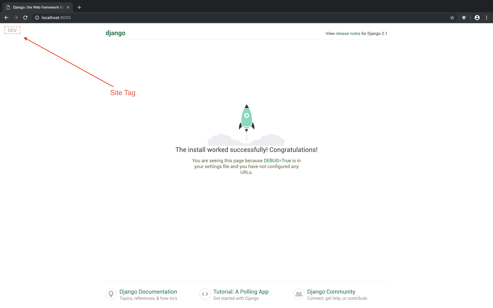

## Django site tag

Django site tag allows you to set 'tags' on each page of your website to indicate current environment, developemnt stages, or whatever else you may want to use such a feature for.



### Installation

```bash
pip install git+https://github.com/yudori/django-site-tag.git
```

### Setup

After installation, add the `django_site_tag` app name to the list of installed apps.

```python
INSTALLED_APPS = [
    ... # django apps

    'django_site_tag',

    ... # custom apps
]
```

Add the site tag middleware to the middleware list. 
```python
MIDDLEWARE = [
    ... # django middleware list

    'django_site_tag.middleware.SiteTagMiddleware',

    ... # custom middleware list
]
```

### Customization

Customization options are provided via django settings. Set any of the following values to add customizations to your site tags.

| Setting Name        | Type           | Description    | Example Value     |
| ------------------- | -------------- | -------------- | ----------------- |
| `SITE_TAG_POSITION`     | string | space-separated css position values in the order: top, right, bottom ,left representing the position of the site tag| '15px 0px 0px 15px'
| `SITE_TAG_TEXT`    | string      |   The text to be written on the tag |  'TEST'
| `SITE_TAG_TEXT_STYLE` | string      |    The css style to be applied to the text | 'padding: 10px;'
| `SITE_TAG_TEXT_BORDER_STYLE`    | string   |   The css style to be applied to the border around the text |    '2px dashed #ff0000;'
| `SITE_TAG_IMAGE` | string     |   The url to the image file to be used instead of text |   '/static/images/tag.jpg'

